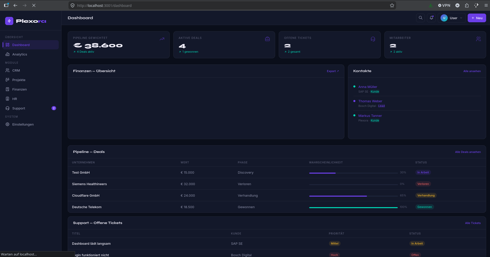
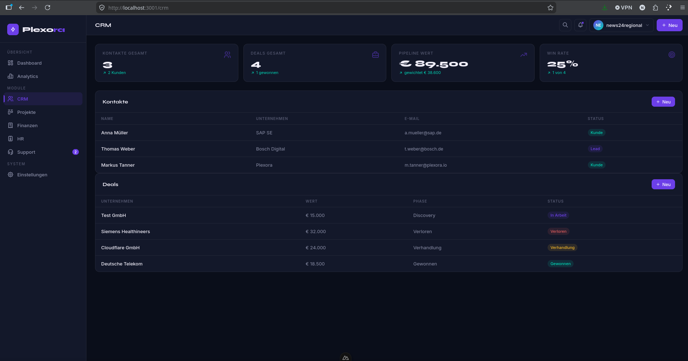
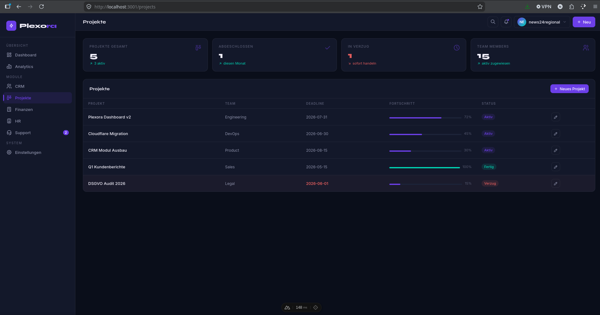
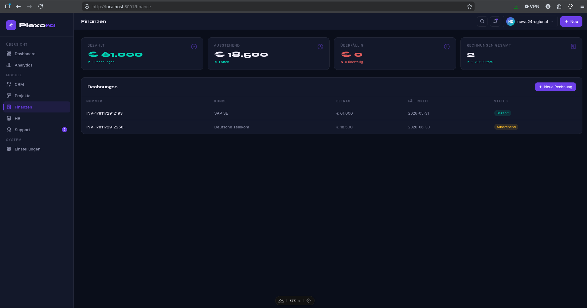
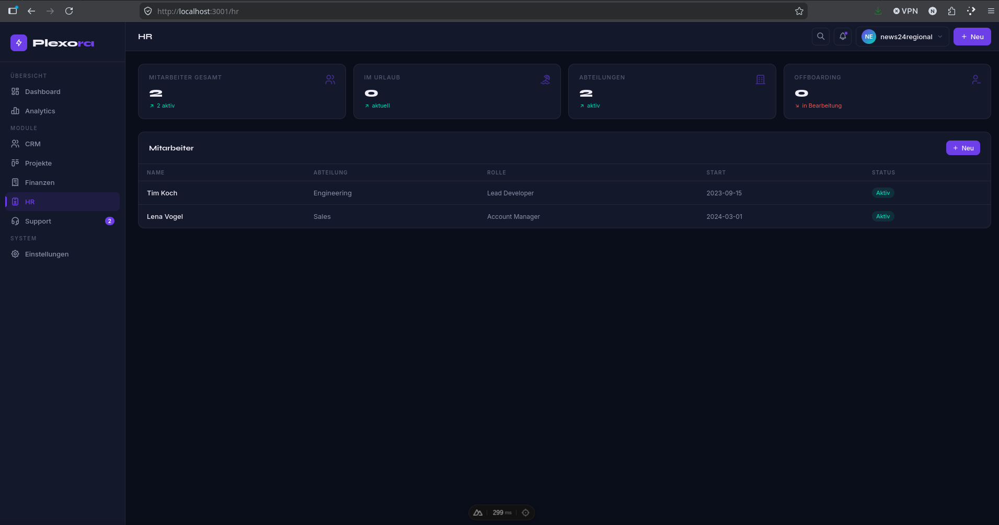
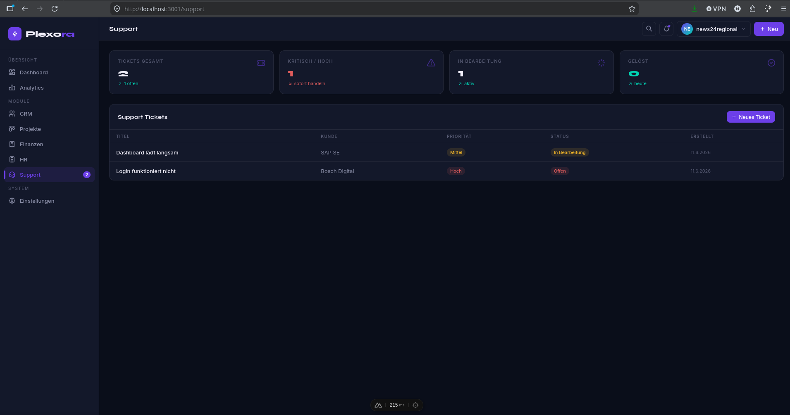
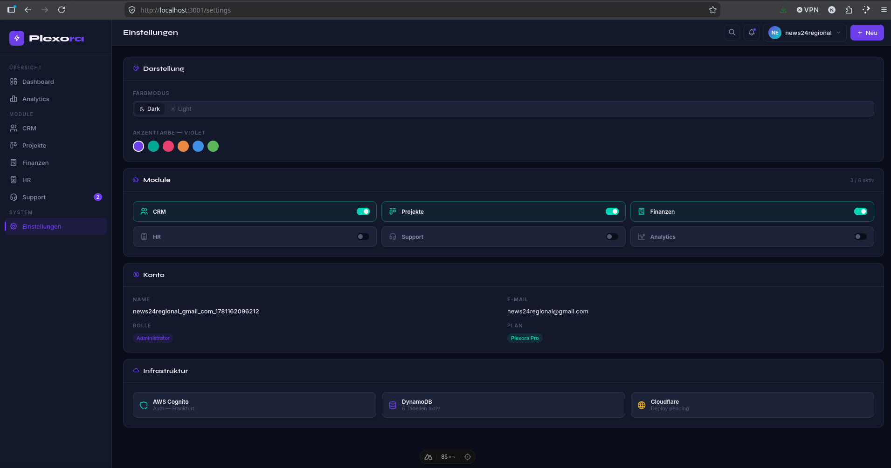
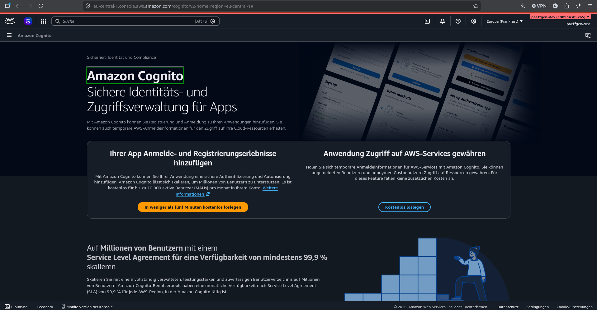

# Plexora — Business Platform

> **Eine Lizenz. Alles drin.**

Warum 10 Tools bezahlen, wenn eines reicht? Plexora ist eine modulare
All-in-One Business-Plattform für KMU — CRM, Projekte, HR, Finanzen
und Support in einer Oberfläche.

Gebaut von einem Entwickler der selbst weiß wie es sich anfühlt, zwischen zu vielen Tools zu wechseln.

---

## Screenshots

### Dashboard

*Pipeline-Übersicht, aktive Deals, offene Tickets und Mitarbeiter auf einen Blick*

### CRM

*Kontakte, Deals mit Phasen, Pipeline-Wert und Win Rate*

### Projekte

*Projektübersicht mit Deadlines, Fortschrittsbalken und Team-Zuordnung*

### Finanzen

*Rechnungen, Zahlungsstatus, ausstehende und überfällige Beträge*

### HR

*Mitarbeiterverwaltung, Abteilungen, Urlaub und Offboarding*

### Support

*Ticket-System mit Prioritäten, Status und Kunden-Zuordnung*

### Einstellungen

*Dark/Light Mode, Akzentfarben, Module ein/ausschalten, Infrastruktur-Status (AWS Cognito, DynamoDB, Cloudflare)*

### Infrastruktur

*AWS Cognito Auth, DynamoDB 6 Tabellen aktiv, Cloudflare Deploy*

---

## Stack

| Bereich | Technologie |
|---------|-------------|
| **Frontend** | Vue 3, Nuxt 4, TypeScript, Tailwind CSS |
| **Backend** | Nuxt Server Routes, Node.js |
| **Database** | AWS DynamoDB, Supabase |
| **Auth** | JWT, Role-based Access Control |
| **Deployment** | Vercel, GitHub CI/CD |

---

## Module

| Modul | Features |
|-------|----------|
| **Dashboard** | Pipeline-Übersicht, KPIs, Live-Daten |
| **CRM** | Kontakte, Deals, Pipelines, Win Rate |
| **Projekte** | Kanban, Meilensteine, Deadlines, Team |
| **Finanzen** | Rechnungen, Zahlungsstatus, Berichte |
| **HR** | Mitarbeiter, Abteilungen, Urlaub, Offboarding |
| **Support** | Tickets, Prioritäten, SLA, Kundenzuordnung |
| **Analytics** | Auswertungen über alle Module |
| **Einstellungen** | Multi-Tenant, Rollen, Konfiguration |

---

## Setup

```bash
# Dependencies installieren
npm install

# Entwicklungsserver starten
npm run dev
# → http://localhost:3001

# Production Build
npm run build
```

### Umgebungsvariablen

```env
DYNAMODB_ACCESS_KEY_ID=
DYNAMODB_SECRET_ACCESS_KEY=
DYNAMODB_REGION=
SUPABASE_URL=
SUPABASE_ANON_KEY=
```

---

## Status

🟢 **In aktiver Entwicklung**

- [x] Dashboard mit Live-Daten
- [x] CRM mit Deal-Pipeline
- [x] Projekt-Management
- [x] Finanzen & Rechnungen
- [x] HR & Mitarbeiterverwaltung
- [x] Support-Ticketsystem
- [ ] Analytics-Modul (in Arbeit)
- [ ] Mobile App
- [ ] API für Drittanbieter

---

## Autor

**Peter Päffgen** — [paeffgen-it.de](https://paeffgen-it.de) · [GitHub](https://github.com/peter1965p)
